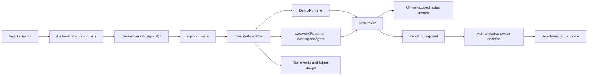

# Архитектура HACKALEM.AI

## Coding-агенты

Boost установлен только как dev dependency. Он выдаёт сведения о пакетах, версионную документацию, маршруты, состояние приложения и локальные инструменты через STDIO MCP. Его возможности доступны разработчику, а не моделям внутри продукта. Runtime не подключает Boost и не получает Tinker, SQL, shell или доступ к репозиторию.

Инструкции для coding-агентов находятся в `AGENTS.md` и `CLAUDE.md`. `composer boost:refresh` обновляет рекомендации установленных пакетов и настройки Boost. MCP-конфигурации не содержат ключей и не меняют глобальные настройки.

## Выполнение задач

Статусы: `queued → running → succeeded | failed | cancelled`; `queued → cancelled | failed` тоже допустимы. Терминальный запуск повторно не выполняется. SDK управляет шагами модели; приложение управляет очередью, доступом, лимитами, событиями и итоговым состоянием.

- `CreateRun` блокирует строку владельца, проверяет лимит трёх активных запусков, принимает idempotency UUID и сохраняет snapshot driver/provider/model/prompt_version/limits. Повторный UUID в рамках одного пользователя возвращает первоначальный запуск.
- Job забирает только `queued` под блокировкой строки. Ни одна транзакция не держится во время сетевого запроса к провайдеру.
- `WorkspaceAgent` предоставляет только `search_notes` и `propose_note`. `ToolBroker` заново проверяет статус и бюджет в транзакции перед каждым действием. Аргументы валидируются сервером.
- `search_notes` возвращает до пяти заметок только владельца запуска; тело каждой ограничено 1500 символами. Полученные тексты считаются недоверенными данными. Нет web/RAG/vector search по внешним источникам.
- `propose_note` сохраняет предложение, но не заметку. `ResolveApproval` проверяет владельца, успешное завершение запуска и известное имя инструмента. Payload берётся из БД, не из запроса подтверждения. Повторное решение не применяется; уникальный FK дополнительно защищает от дублирования заметок.
- При отмене/ошибке pending-предложения отклоняются. Поздний ответ модели не перезаписывает отмену. Уже отправленный HTTP-запрос к провайдеру нельзя гарантированно прервать; он может тарифицироваться.
- Транзакции блокируют сначала run, затем approval, чтобы операции подтверждения и отмены имели одинаковый порядок блокировок.
- Повторное создание задачи после ошибки — новый запуск. Автоматические повторы дорогих AI-вызовов выключены (`tries=1`).

## Ограничения

По умолчанию — до 5 шагов SDK, 2048 output tokens **на один вызов модели**, 8 tool calls, 120 секунд timeout запроса, 180 секунд job timeout. Это не денежный бюджет и не общий лимит всех токенов. Верхние границы задаются в `config/agents.php` и копируются в запуск. Queue `retry_after=240` длиннее job timeout.

Оставленные worker задачи старше 5 минут и queued-задачи старше часа закрывает `agents:expire-runs` каждую минуту через scheduler. В production отдельно нужны worker и `schedule:run`. `composer dev` включает оба локально. После жёсткого завершения worker нельзя полагаться только на callback `failed` — поэтому есть очистка зависших запусков.

## Данные и доступ

`agent_runs` хранит вход, выход, настройки, usage и timestamps; `run_events` — журнал; `tool_approvals` — предложения и решение; `notes` — подтверждённую память владельца. В этой версии каждый запуск независим: предыдущий диалог автоматически не подставляется. SDK conversation tables опубликованы для будущего использования, но runtime пока ими не пользуется.

Аутентификация и email verification — Laravel Fortify. Inertia-routes требуют `auth,verified`. Для Filament нужны подтверждённый email и роль `super_admin` с guard `web`. `User::canAccessAdmin()` задаёт единое условие для панели, policies управления и просмотра всех запусков. `canAccessPanel()` дополнительно проверяет ID панели `admin`; auth middleware повторно выполняется на Livewire-запросах. Регистрация назначает только роль «Участник»; присланные клиентом роли и разрешения игнорируются.

В панели доступны пользователи, роли и каталог разрешений. `AccessPermission` содержит только действия фронтенда. `AccessControlSeeder` создаёт три стартовые роли: `super_admin` с доступом ко всем разделам панели и правами фронтенда, «Наблюдатель» с просмотром своих запусков и «Участник» с действиями над своими запусками. Все прочие роли и прямые разрешения пользователя действуют только на фронтенде. Повторный seed не сбрасывает настройки обычных ролей. «Участник» назначается при регистрации, через локальную CLI-команду без `--admin` и при создании пользователя без явного выбора ролей; эту роль нельзя удалить или переименовать, но её разрешения можно настроить. Каталог разрешений нельзя произвольно менять через UI: новые действия добавляются вместе с их серверной реализацией.

Policies разрешают управление пользователями, ролями и доступами только подтверждённому `super_admin`. Прямые разрешения пользователя складываются с разрешениями всех его ролей, но не открывают админпанель. Сохранение и удаление проходят через `app/Actions/Access`, повторно проверяющие права и блокирующие строку `super_admin` на время транзакции. Последнего супер-администратора нельзя лишить роли, подтверждения email или удалить, включая удаление через пользовательский профиль. Системная роль и демо-аккаунт защищены в панели, назначенную пользователям роль удалить нельзя.

Миграция `restrict_admin_access_to_super_admin` переименовывает прежнюю роль «Администратор», сохраняя пользователей, или объединяет её назначения с уже существующей `super_admin`. Старые разрешения панели (`admin.access`, `runs.view`, `users.*`, `roles.view`, `permissions.view`, `access.manage`) и их назначения удаляются. Настройки фронтенда обычных ролей сохраняются. Обратная миграция намеренно запрещена: удалённые назначения невозможно достоверно восстановить; для изменения модели доступа нужна новая миграция.

Права пользовательского приложения: `workspace.view` (свои запуски и заметки), `workspace.runs.create`, `workspace.runs.cancel`, `workspace.approvals.resolve`. Для любого действия нужно также право просмотра; write-права сами по себе не открывают рабочее пространство. «Наблюдатель» получает только `workspace.view`. Миграция выдаёт «Участника» существующим пользователям без ролей и прямых разрешений, сохраняя их прежний доступ, но не расширяет пользовательские роли с собственными настройками.

`HandleInertiaRequests` передаёт публичные поля пользователя, названия ролей и итоговые разрешения в `auth`; `Inertia::always` обновляет их даже при частичных загрузках. React использует `usePermissions().can()` и `hasRole()` для навигации и создания запусков. Карточка запуска получает отдельные `can.cancel` и `can.resolveApprovals`, рассчитанные серверной policy с проверкой владельца и также включаемые в частичные ответы. Скрытие кнопок дополняется серверными проверками: список, создание, отмена и решение по proposal проверяются независимо от UI. Права подхватываются на следующем запросе или polling; уже открытая страница не является источником разрешений для сервера. Без `workspace.view` dashboard показывает экран назначения доступа, а endpoints запусков возвращают 403.

Просмотр всех запусков в панели доступен только `super_admin`, сами запуски остаются read-only. Глобального обхода policies для супер-администратора нет: пользовательские маршруты и инструменты по-прежнему проверяют владельца, и чужие предложения подтверждать нельзя. Ссылка «Админпанель» в React-меню показывается только при роли `super_admin` и подтверждённом email.

Локальный демо-доступ включается через `DEMO_ADMIN_ENABLED=true`. `EnsureDemoAdmin` создаёт или восстанавливает проверенного администратора `admin@hackalem.test` с паролем `admin`; пароль хранится как hash. Action вызывается из `DemoAdminSeeder`, подготовки проекта и `mount()` страницы входа Filament. Он действует только в `local` / `testing`, не меняет других пользователей и не перехеширует правильный пароль при каждом открытии страницы. Подсказка с демо-данными использует то же условие включения. Обычные PHP-тесты принудительно отключают этот режим, а тесты демо-доступа включают его явно.

Сырые исключения провайдера не попадают в UI или журнал: сохраняются только ID запуска и класс исключения. Prompt, output и текст заметок сохраняются в БД намеренно; перед production следует определить сроки хранения и правила доступа к этим данным. Отдельного журнала скрытых рассуждений нет.

## Границы готовности

Это рабочая база для разработки, а не готовая платформа для произвольного выполнения кода. Нет shell/browser/file tools, внешних side effects, multi-agent orchestration, streaming token UI, биллинга, автоматической миграции prompt versions и оценки качества реальной модели. Новые возможности добавляются отдельными проверяемыми изменениями.
